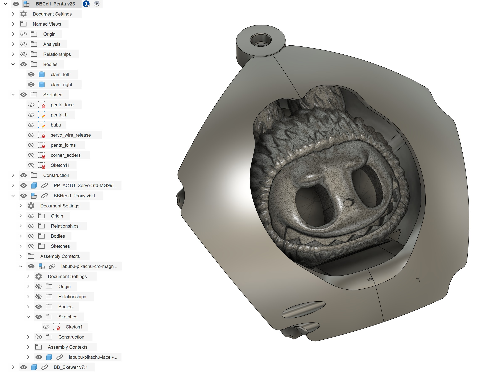
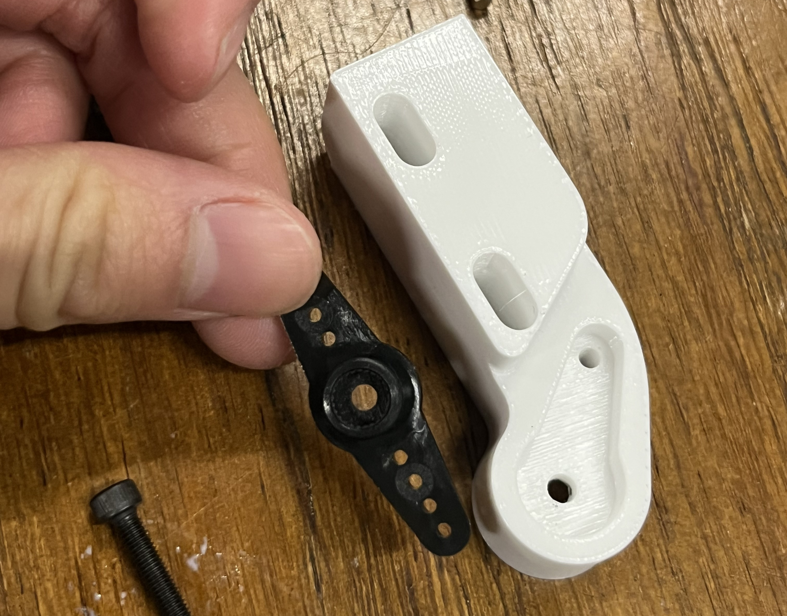
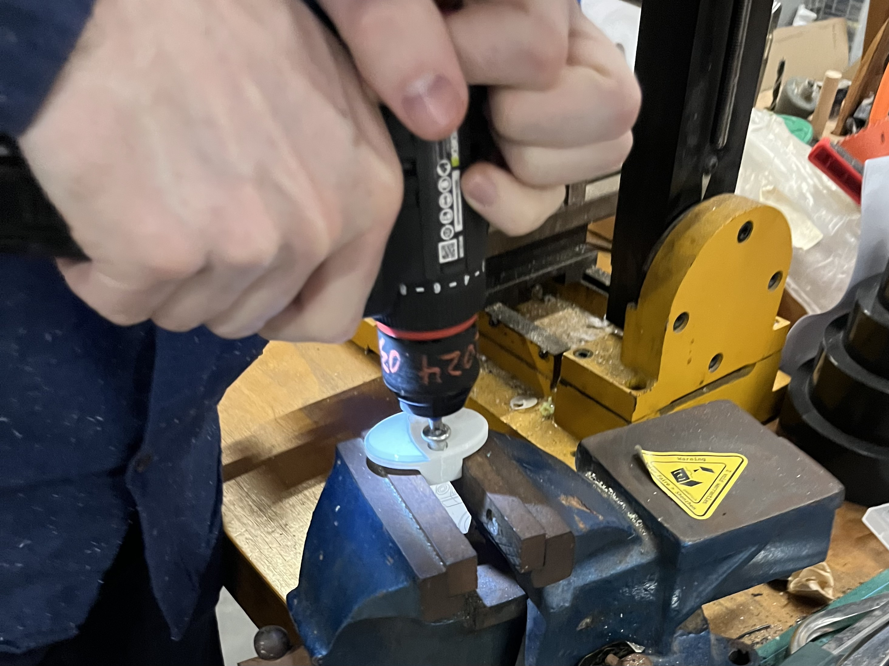
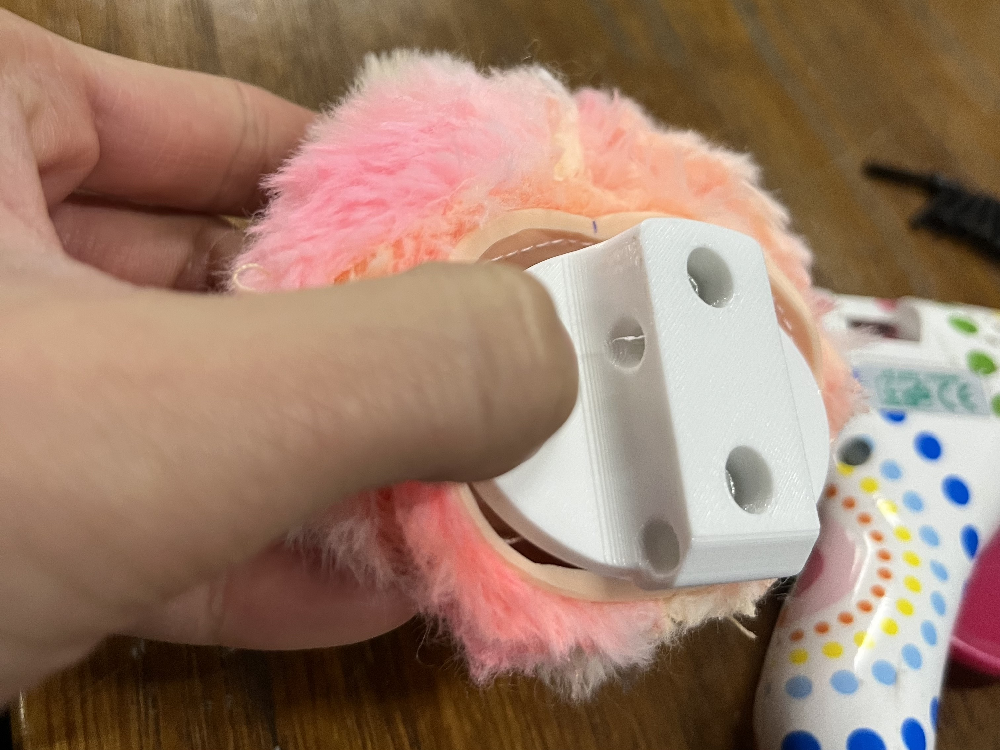
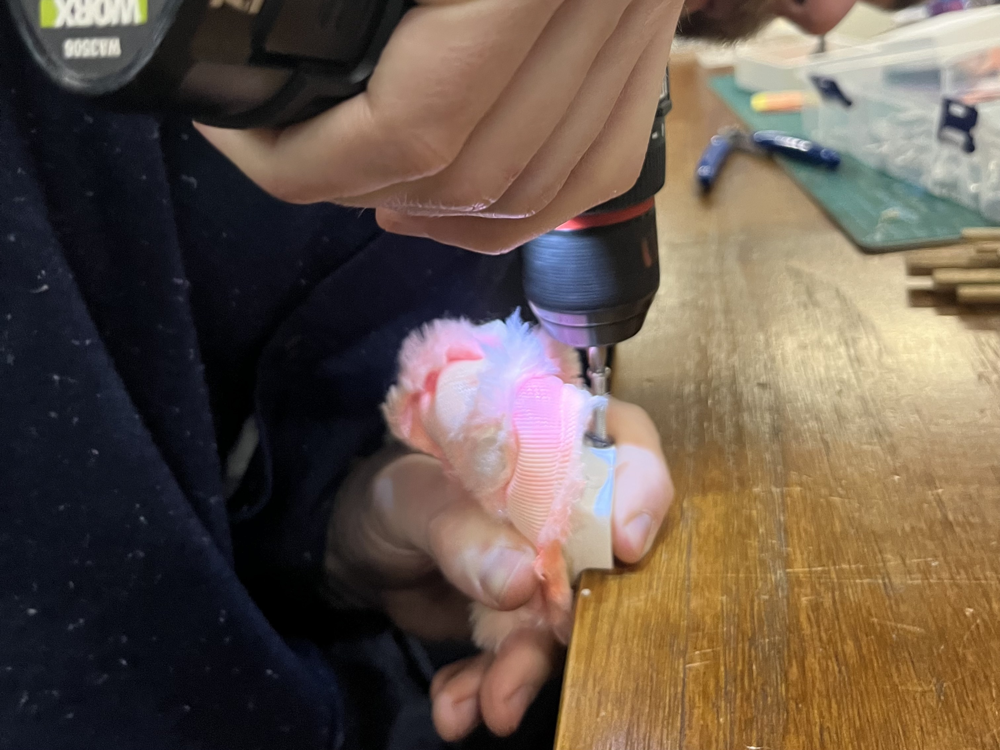
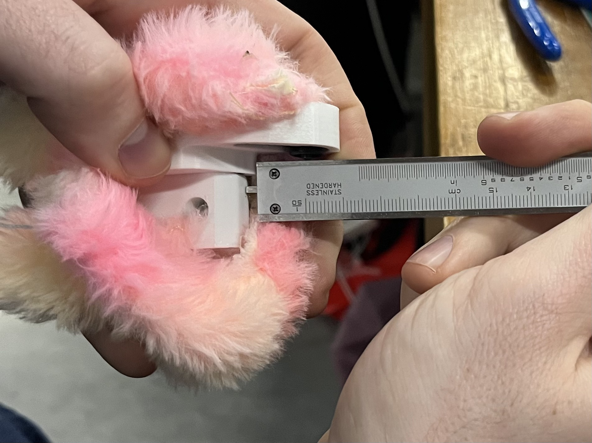
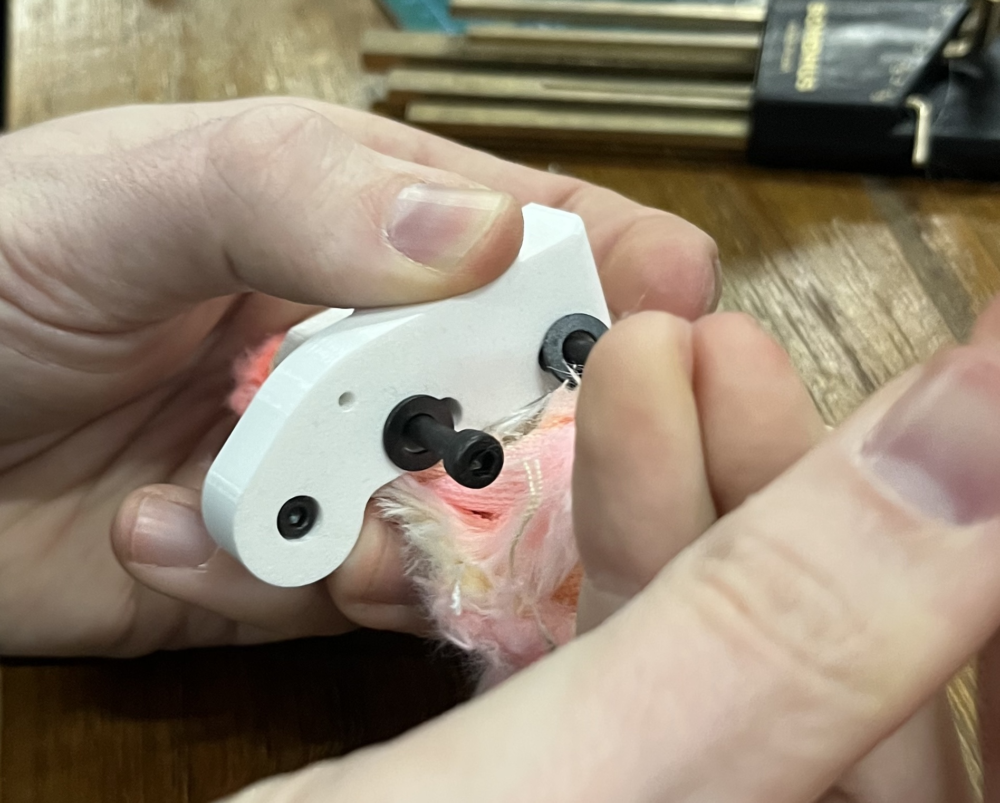
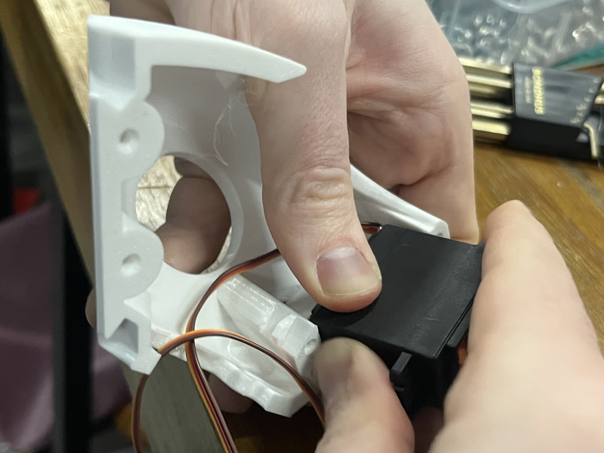
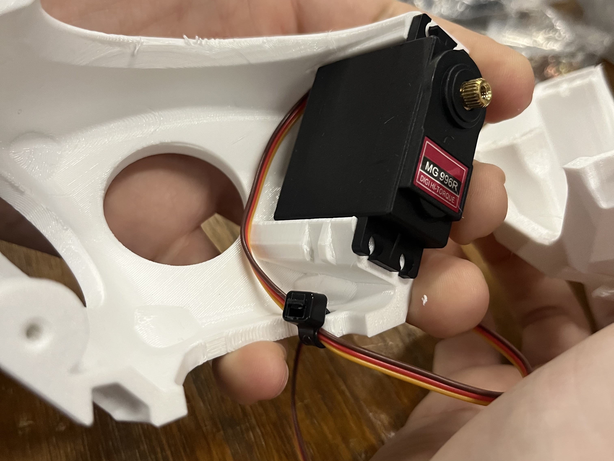
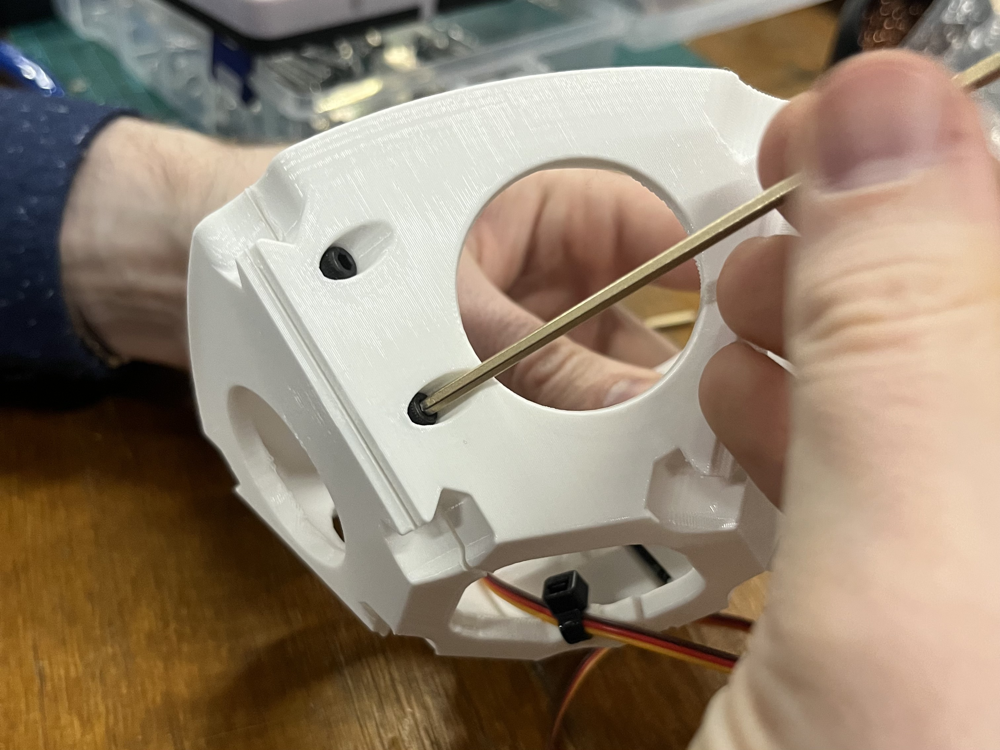

# mf labubu

Labububot (they/them) is a 12-headed, spherical robot.

https://github.com/user-attachments/assets/dadfb60f-6797-4210-bd5c-d21815fad00e

https://github.com/user-attachments/assets/a78946b9-4492-444b-ae28-aa99f99fa427

https://github.com/user-attachments/assets/b0edc415-2791-42cc-b36b-7b1b4265cd20

## progress (reverse chronological)

https://github.com/user-attachments/assets/68c9fd3b-862c-404a-a182-f51555a04e33




## concept
Labububot is a playful critique of social robots and their forms.

<!-- Roboticists claim that the dawn of ubiquitous robots is imminent. -->
Human-robot interaction research frequently begins with the claim that we will soon be surrounded by robots in our everyday lives, and as delivery drones and cleaning robots are already somewhat commonplace in Shenzhen, the claim feels substantial.

If this is true, our world of human cyborgs will soon confront a new, baffling species, neither man nor animal, too agentic to be considered a machine, too mechanical to be considered an organism. From the field of monster theory:

> "Jeffrey Weinstock explains that monsters ‘are things that should not be, but nevertheless are--and their existence raises vexing questions about humanity’s understanding of and place in the universe"
> 
> (Monsters: interdisciplinary explorations in monstrosity, Erle & Hendry 2020)

We claim that social robots can be analyzed as monsters: for example, a disembodied, illuminated face that hides a camera, which blinks its digital eyes at you, records your speech, and metabolizes it through a large language model before playing back a synthesized "speech" waveform arguably "should not be" according to the laws of God or nature, but nevertheless is.


... not to name names.

Labubu is also, famously, a [monster](https://www.popmart.com/us/collection/11/the-monsters). 
Labubu is also a classic example of [baby schema](https://pmc.ncbi.nlm.nih.gov/articles/PMC3260535/).

> Ethologist Konrad Lorenz suggested that certain infant characteristics evoke a positive affective response in the human. He described the **baby schema** (‘Kindchenschema’) as a set of infantile physical features such as the large head, high and protruding forehead, large eyes, chubby cheeks, small nose and mouth, short and thick extremities and plump body shape, that is perceived as cute or cuddly and elicits caretaking behavior from other individuals (Lorenz 1943).
> 
> (Baby Schema in Infant Faces Induces Cuteness Perception and Motivation for Caretaking in Adults, Glocker et al 2012, emphases mine)


Baby schema is commonly employed in robot design to make social robots appear friendly.
By decapitating Labubus and reconstituing a new, less anthropomorphic form, we hope to subvert the aesthetic norms of social robotics and evoke a less straightforward, more confusing set of feelings in the viewer.
We pay homage to Mary Shelley's Frankenstein, which is also a monster comprised of corpses.

By presenting Labububot as an indisputably monstrous social robot we hope to call into question the monstrosity of other social robots, even those which are designed to look [cute and, therefore, trustworthy](https://journals.sagepub.com/doi/10.1177/17298806231168486).
Further, we hope that analyzing social robots through the lens of monster theory will afford interesting insight into not only the design of social robots but also the philosophical question: what does it mean to be human?

## future work
* Cover Labububot in fur
* Controls: servo actuation -> rolling in a desired movement direction
* Continue inquiry into monster theory, posthumanism, social robotics, refine interactions and submit Labububot to [ICSR Art / Design Competition](https://icsr2026.uk/competition/) or other art / robotics venue

# software
## server quickstart
navigate to `labububot/server`, then run:
```bash
npx http-server -p 8080
```
or
```bash
python3 -m http.server 8080
```

## what are all of these firmware subfolders?
### sparkfun_imu_test
get acc + gyr data from the LSM6DSV16X, which is connected via SPI to the ESP32. 
based on the [SPI example](https://docs.sparkfun.com/SparkFun_6DoF_LSM6DSV16X/examples/#example-3-spi) using the SparkFun library - not useful anymore as it does not support quaternion computation or gravity vector

### stm32duino_imu_test
gets acc, gyr, quat, gravity from LSM6DSV16X, which is connected via SPI to the ESP32.
uses the [stm32duino LSM6DSV16X library](https://github.com/stm32duino/LSM6DSV16X/blob/0572b20a4ad4c1bc7852e0fc6c756f538447b6ab/examples/LSM6DSV16X_Sensor_Fusion/LSM6DSV16X_Sensor_Fusion.ino)

### ble test
sends a count from the ESP32 to the browser (which should show up under Fetched Value).
if you send a message to the ESP32 (under Send Message) it will print it to the Serial monitor.
based on [this blog post](https://RandomNerdTutorials.com/esp32-web-bluetooth/)

has browser UI: see `ble_test.html`

### pca9685_test
this is exactly the `servo.h` example from [Seeed docs for this PWM driver](https://wiki.seeedstudio.com/Grove-16-Channel_PWM_Driver-PCA9685/#software)

### ping test
browser sends pings (timestamp, at time of send) to the ESP32, which sends it back immediately.
under ping time, we report the round trip durations.

has browser UI: see `ping.html`

# electronics
* battery
* ESP32S3
	* [schematic](https://files.seeedstudio.com/wiki/SeeedStudio-XIAO-ESP32S3/res/XIAO_ESP32S3_SCH_v1.2.pdf)
	* pinout
	* ![[esp32s3_pinout.jpeg]]
* [6dof IMU](https://www.sparkfun.com/sparkfun-6dof-imu-breakout-lsm6dsv16x-qwiic.html)
	* [software setup](https://docs.sparkfun.com/SparkFun_6DoF_LSM6DSV16X/software_setup_and_programming/)
	* SPI
		* [SPI with ESP32S3](https://wiki.seeedstudio.com/xiao_esp32s3_pin_multiplexing/#hardware-preparation-4)
* servos
* Grove - 16 Channel PWM Driver (PCA9685) 
	* connected via I2C
* buck converter

# assembly
- 1 servo
- 1 servo arm
- 1 decapitated + unstuffed labubu head
- left and right clam pieces
- arm piece
- face plate
- 6 m3 x 18 socket head cap screws (shcs)
- 1 m3 x 10 shcs
- 2 m4 x 35 shcs + washers
- 2 big chonky heavy boys m8?

for one bubu:
1. truncate 2-directional servo arm to fit into arm piece

2. screw m3 x 10 shcs in through arm and servo arm

3. drill chubby chonky heavy boys into face plate

4. hot glue time - **MAKE SURE ORIENTATION OF FACE PLATE IS CORRECT - screw holes on the side of the center protrusion should be away from the ears -- flat edge of center protrusion up, chamfered edge down; most important to vertically align face plate with labubu face.** 1 glue stick worth of glue injected from around the edges


5. drill m4 x 35 into face plate holes to create threads, then undrill them

6. position arm against face plate, use allen wrench to screw in m4 x 35s + washers through arm first, then face plate - approximate 3.5mm of overhang, align slot


7. put arm on servo, screw m3x10 in to secure (we didn't do it in this order so no fotos)
8. ==TODO: stuff and sew labubu==
9. shove servo into servo slot, on clamshell which has a cutout for the wire. position wire side in slot and then shove the boy in


10. zip tie wire through zip tie slot so that wire is secure, but leave slack so wire doesn't pull on servo. cut zip tie


**first all 12 first halves, then zero servos before assembling second halves**

11. put both halves together. screw 4 m3 x 18 via allen wrench. in the other two holes, screw 2 m3 x 10 via allen wrench. tighten all together to secure two halves, until gap is closed - DON'T OVERTIGHTEN
here are the holes for the m3x18:

here are the holes for the m3x10:



# references
* [ben and dimitar's neilbot board](https://gitlab.cba.mit.edu/classes/863.25/CBA/cba-machine/-/tree/main/hardware/main)
* [neilbot](https://fab.cba.mit.edu/classes/MAS.863/CBA/neilbot/index.html)
* [miranda's neilbot docs](https://fab.cba.mit.edu/classes/863.25/people/MirandaLi/pages/week11.html)
