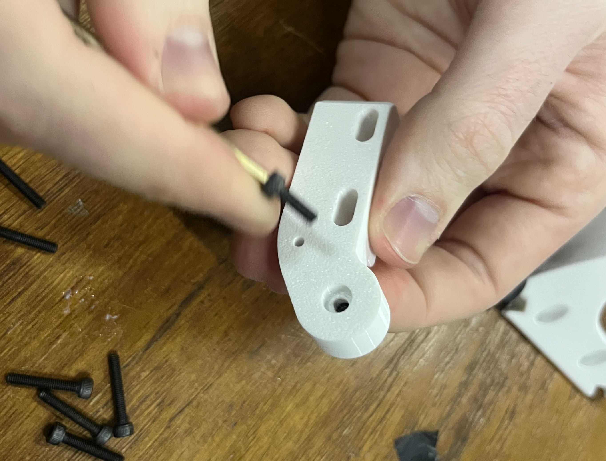
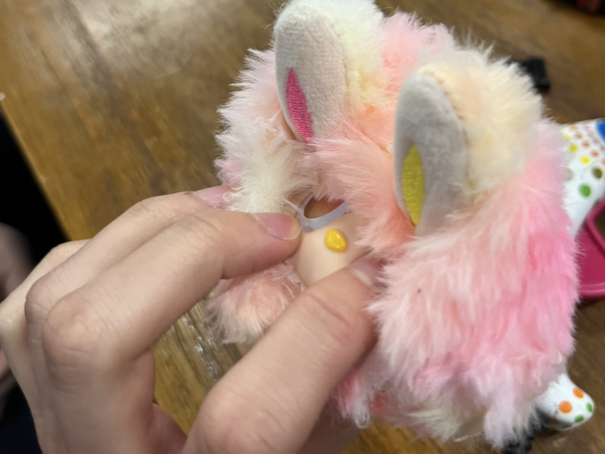
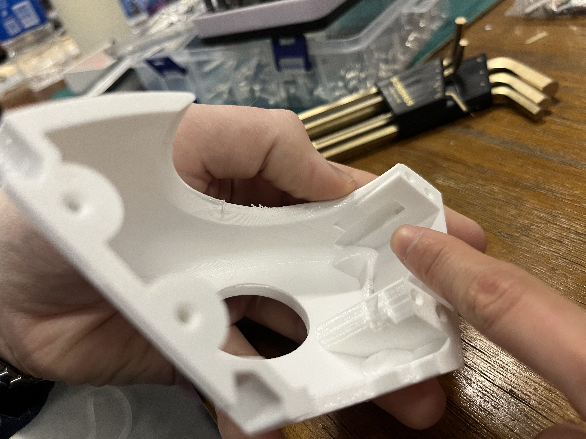
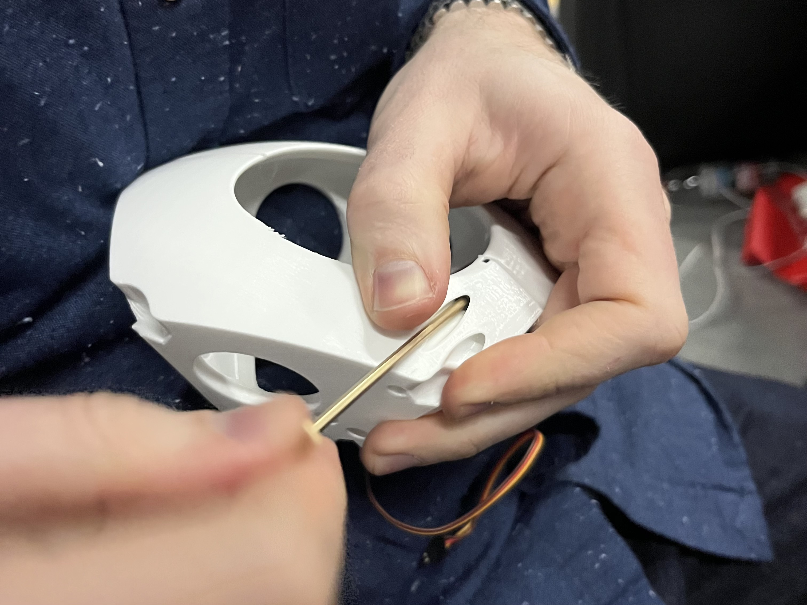

# mf labubu

ancestor:
- [neilbot](https://fab.cba.mit.edu/classes/MAS.863/CBA/neilbot/index.html)
- [miranda's neilbot docs](https://fab.cba.mit.edu/classes/863.25/people/MirandaLi/pages/week11.html)


threejs digital twin labububot controller


BLE soon :)

# software

## server quickstart
make sure ur in `labububot/server`
### Option 1: Using npx (Node.js)
```bash
npx http-server -p 8080
```

### Option 2: Using Python
```bash
python3 -m http.server 8080
```

## what are all of these firmware subfolders?
### sparkfun_imu_test
get acc + gyr data from the LSM6DSV16X, which is connected via SPI to the ESP32. 
based on the [SPI example](https://docs.sparkfun.com/SparkFun_6DoF_LSM6DSV16X/examples/#example-3-spi) using the SparkFun library - not useful anymore as it does not support quaternion computation or gravity vector

### stm32duino_imu_test
gets acc, gyr, quat, gravity from LSM6DSV16X, which is connected via SPI to the ESP32.
uses the [stm32duino LSM6DSV16X library](https://github.com/stm32duino/LSM6DSV16X/blob/0572b20a4ad4c1bc7852e0fc6c756f538447b6ab/examples/LSM6DSV16X_Sensor_Fusion/LSM6DSV16X_Sensor_Fusion.ino)

### ble test
sends a count from the ESP32 to the browser (which should show up under Fetched Value).
if you send a message to the ESP32 (under Send Message) it will print it to the Serial monitor.
based on [this blog post](https://RandomNerdTutorials.com/esp32-web-bluetooth/)

has browser UI: see `ble_test.html`

### pca9685_test
this is exactly the `servo.h` example from [Seeed docs for this PWM driver](https://wiki.seeedstudio.com/Grove-16-Channel_PWM_Driver-PCA9685/#software)

### ping test
browser sends pings (timestamp, at time of send) to the ESP32, which sends it back immediately.
under ping time, we report the round trip durations.

has browser UI: see `ping.html`

# electronics
* battery
* ESP32S3
	* [schematic](https://files.seeedstudio.com/wiki/SeeedStudio-XIAO-ESP32S3/res/XIAO_ESP32S3_SCH_v1.2.pdf)
	* pinout
	* ![[esp32s3_pinout.jpeg]]
* [6dof IMU](https://www.sparkfun.com/sparkfun-6dof-imu-breakout-lsm6dsv16x-qwiic.html)
	* [software setup](https://docs.sparkfun.com/SparkFun_6DoF_LSM6DSV16X/software_setup_and_programming/)
	* SPI
		* [SPI with ESP32S3](https://wiki.seeedstudio.com/xiao_esp32s3_pin_multiplexing/#hardware-preparation-4)
* servos
* Grove - 16 Channel PWM Driver (PCA9685) 
	* connected via I2C
* buck converter

# assembly
- 1 servo
- 1 servo arm
- 1 decapitated + unstuffed labubu head
- left and right clam pieces
- arm piece
- face plate
- 6 m3 x 18 socket head cap screws (shcs)
- 1 m3 x 10 shcs
- 2 m4 x 35 shcs + washers
- 2 big chonky heavy boys m8?

for one bubu:
1. truncate 2-directional servo arm to fit into arm piece

2. screw m3 x 10 shcs in through arm and servo arm

3. drill chubby chonky heavy boys into face plate

4. hot glue time - **MAKE SURE ORIENTATION OF FACE PLATE IS CORRECT - screw holes on the side of the center protrusion should be away from the ears -- flat edge of center protrusion up, chamfered edge down; most important to vertically align face plate with labubu face.** 1 glue stick worth of glue injected from around the edges


5. drill m4 x 35 into face plate holes to create threads, then undrill them

6. position arm against face plate, use allen wrench to screw in m4 x 35s + washers through arm first, then face plate - approximate 3.5mm of overhang, align slot


7. put arm on servo, screw m3x10 in to secure (we didn't do it in this order so no fotos)
8. ==TODO: stuff and sew labubu==
9. shove servo into servo slot, on clamshell which has a cutout for the wire. position wire side in slot and then shove the boy in


10. zip tie wire through zip tie slot so that wire is secure, but leave slack so wire doesn't pull on servo. cut zip tie


**first all 12 first halves, then zero servos before assembling second halves**

11. put both halves together. screw 4 m3 x 18 via allen wrench. in the other two holes, screw 2 m3 x 10 via allen wrench. tighten all together to secure two halves, until gap is closed - DON'T OVERTIGHTEN
here are the holes for the m3x18:

here are the holes for the m3x10:


# references
* [ben and dimitar's neilbot board](https://gitlab.cba.mit.edu/classes/863.25/CBA/cba-machine/-/tree/main/hardware/main)

# things we need to buy or find
* buck converters
* 2 spoots PETG
* mf glue 