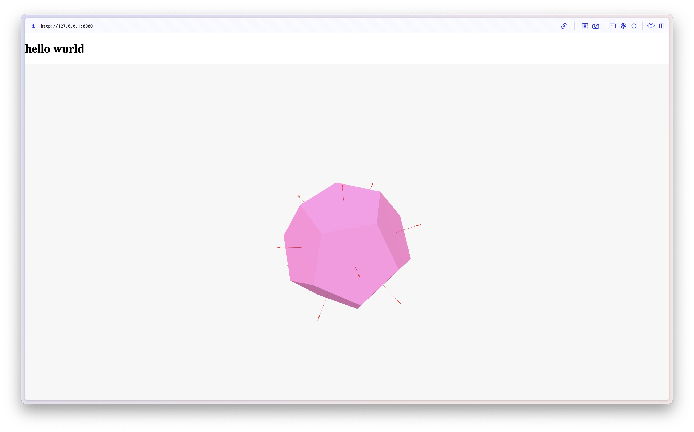

# mf labubu

ancestor:
- [neilbot](https://fab.cba.mit.edu/classes/MAS.863/CBA/neilbot/index.html)
- [miranda's neilbot docs](https://fab.cba.mit.edu/classes/863.25/people/MirandaLi/pages/week11.html)


threejs digital twin labububot controller


BLE soon :)

# software

## server quickstart
make sure ur in `labububot/server`
### Option 1: Using npx (Node.js)
```bash
npx http-server -p 8080
```

### Option 2: Using Python
```bash
python3 -m http.server 8080
```

## tests
### ble test
flash `ble_test_ino.ino` onto the ESP32.
on controller webpage (after starting server ofc), connect to BLE device.
this should send a value that iteratively increases from the ESP32 to the browser (which should show up under Fetched Value), and if you send a message to the ESP32 (under Send Message) it will print it to the Serial monitor.

# electronics
* battery
* ESP32S3
	* [schematic](https://files.seeedstudio.com/wiki/SeeedStudio-XIAO-ESP32S3/res/XIAO_ESP32S3_SCH_v1.2.pdf)
	* pinout
	* ![[esp32s3_pinout.jpeg]]
* [6dof IMU](https://www.sparkfun.com/sparkfun-6dof-imu-breakout-lsm6dsv16x-qwiic.html)
	* [software setup](https://docs.sparkfun.com/SparkFun_6DoF_LSM6DSV16X/software_setup_and_programming/)
	* SPI
		* [SPI with ESP32S3](https://wiki.seeedstudio.com/xiao_esp32s3_pin_multiplexing/#hardware-preparation-4)
* servos
* Grove - 16 Channel PWM Driver (PCA9685) 
	* connected via I2C
* buck converter

# hardware
* 12 labubus

# references
* [ben and dimitar's neilbot board](https://gitlab.cba.mit.edu/classes/863.25/CBA/cba-machine/-/tree/main/hardware/main)